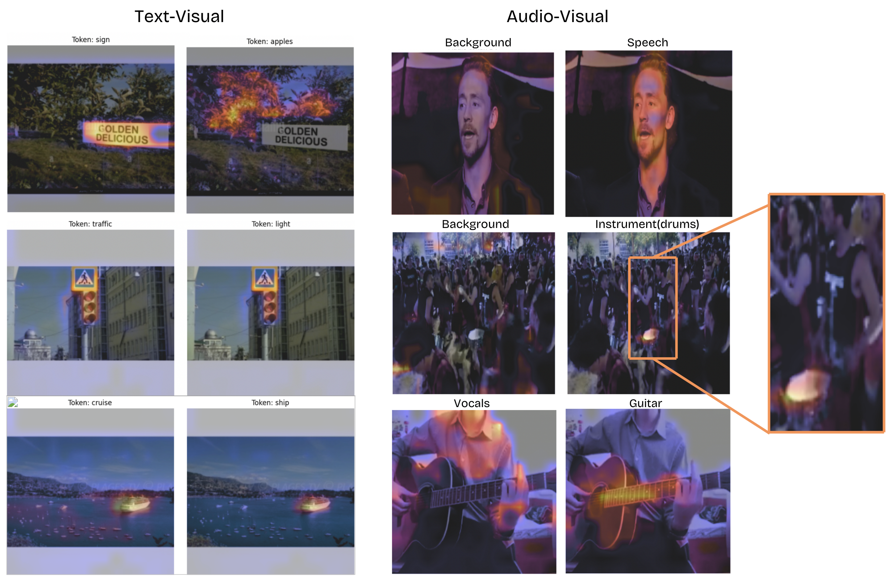

# Triad: Dense Cross-Modal Grounding

Dense feature learning between video, audio, and text modalities. Built on HuBERT, DINOv2, and DistilBERT backbones with contrastive learning for localized feature alignment.

This is a very early research project for dense multi-modal learning, with lots of room for improvement and experimentation. The current model was trained on a subset of AudioSet (~400k videos) and CC3M (~2M image-text pairs) for just one epoch, so while it shows promising behavior, it's definitely not state-of-the-art yet.

## What even are we doing?

Unlike models like ImageBind that focus on global alignment between modalities, Triad learns fine-grained correspondences between specific regions in images/video and segments in audio/text. This means you can:

- Locate specific objects in images using either spoken words or text
- Find which parts of an image correspond to specific sounds
- Ground text descriptions to precise image regions
- Get dense feature maps that work across all three modalities
- (Unvalidated) Allow for transitive text-audio feature grounding without any explicit pairs in dataset

The model is also relatively lightweight and can be trained on consumer hardware - the results here were achieved with a single RTX 3080. (Given you have enough patience ofcourse)

## Architecture 

The model uses three specialized backbones:
- Vision: DINOv2 for dense visual features 
- Audio: HuBERT for audio feature extraction
- Text: DistilBERT for textual understanding

These feed into a shared cross-modal attention mechanism that learns to align features across modalities. The model is trained using contrastive learning, pushing corresponding features closer while separating unrelated ones with a max-mean pooling strategy for dense feature learning.

## Acknowledgments

Aggregation strategy inspired by DenseAV (Hamilton et al., 2024): https://arxiv.org/abs/2406.05629
